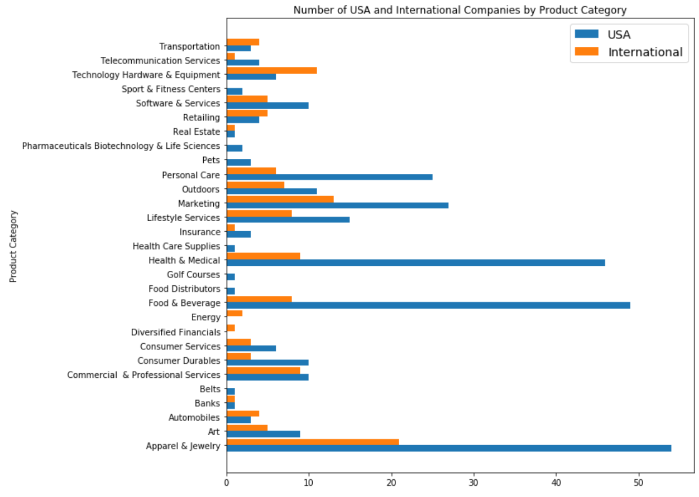
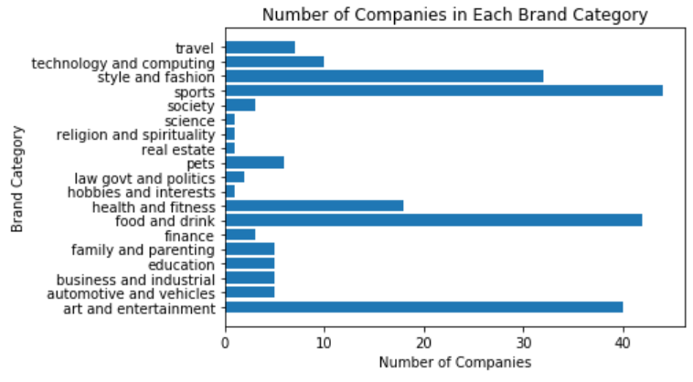
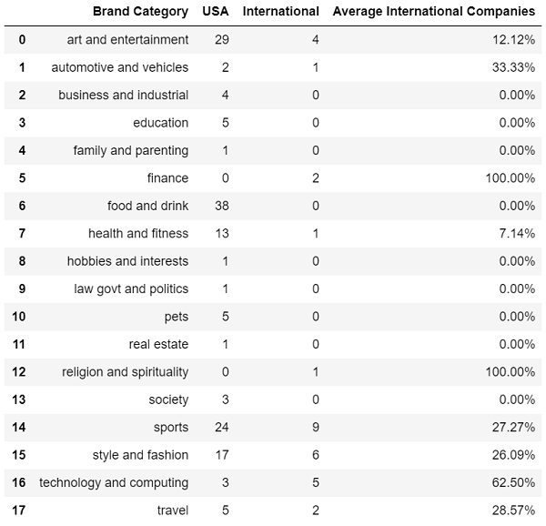

# OpenSponsorship Intern Assessment
The main purpose of this analysis was to split the given data into two different subsets of data: 
* Product Category
* Brand Category    
Then from these subsets, I created visualizations using Matplotlib to showcase the number of companies in each product or brand category, as well as a group horizontal bar chart comparing the number of companies based in and out of the United States.  

## Steps in Data Cleansing and Creating Visualizations
You may view my Jupyter Notebook file [here](data_cleaning.ipynb).
I commented in every cell to describe each step of the process. Please let me know if you have any questions.  

## Analysis
Initially, it seemed as if there was not much to go off of given the amount of Null datapoints, however, I was able to find enough data to create an analysis.  

### Product Category

* Found that the three most popular Product Categories were in Apparel & Jewelery, Food & Beverage, and Health & Medical.
* This makes sense since Apparel, Food, and Health services are important components of the Sports Industry.    

 
* I then compared the number of companies in and out of the US and created a DataFrame showcasing 
* Even though Apparel & Jewelery, Food & Beverage, and Health & Medical were the most popular categories, they were among the smallest in percentages of companies hailing from outside the United States.
* Instead, Diversified Financials, Energy, and Technology Hardware & Equipment were among the highest in international representation.

### Brand Category

* Alternatively, I took a look at the Brand Categories and found that there was an abundance of subcategories and decided to create broader categories instead.
* After doing this I found that the majority of companies came from the Sports category along with Food & Drink and Art & Entertainment.

 
* I then took a closer look to find out that 27.27% of the companies in the Sports category were international, which was relatively on the high side compared to the other categories.
* Among those categories that had a high percentage of international companies were Finance, Religion & Spirituality, and Technology & Computing.
* This is mostly in line with the categories in my Product Category Analysis.
